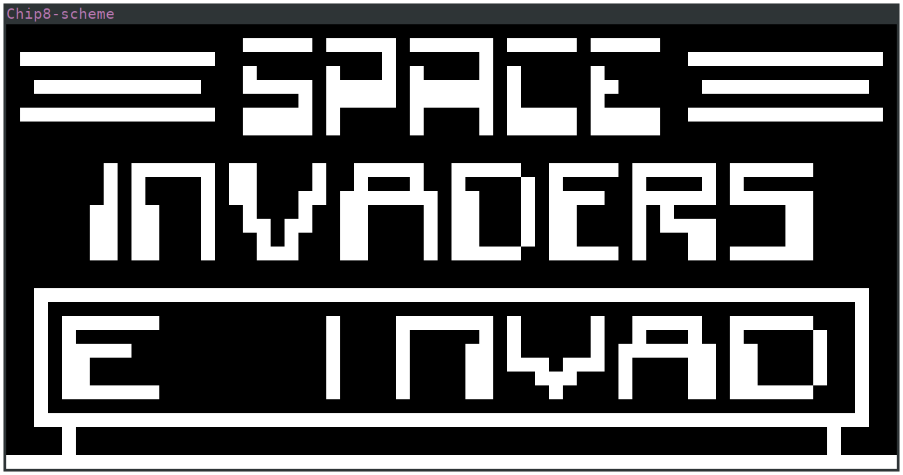

# CHIP-8 emulator implemented in (Chicken) Scheme

This is an implementation of the CHIP-8 emulator in [Chicken
Scheme](https://wiki.call-cc.org/).

The implementation is completed and working as expected, except for the sound
which is not implemented (the chicken sdl2 bindings don't provide the audio
functions).

This is my first "serious" project in a Lisp language, and I worte it to have a
better feeling of what it feels like to program in Lisp.  I believe a CHIP-8
emulator is not the best project for a Lisp language, but nevertheless it was
an interesting (and sometimes frustrating) experience.

# Screenshot



# Building
```sh
source env.sh
chicken-install sdl2
chicken-install args
chicken-install format
chicken-install memory
chicken-install defstruct
chicken-install modular-arithmetic
chicken-install srfi-151
chicken-csc main.scm
```

# Running
```sh
./main --scale 8 INVADERS
```
